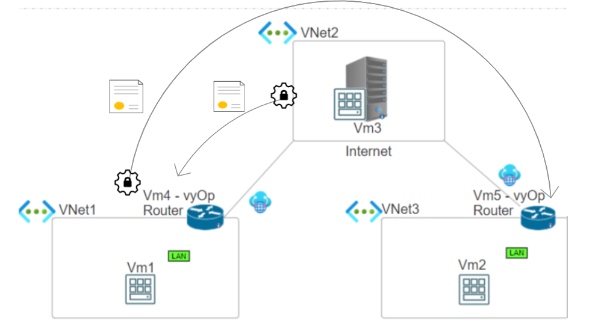

# Capstone Proposal

## 1. Overview

- **What are you planning to build?**
  - Our team will build a Command Line Interface Tool that implements the TURN protocol. This tool will allow users to send and receive data to another computer behind a NAT with a TURN server acting as an intermediary. The actual implementation of the protocol will be given to our customer, Capt Burn, USMC at MARFORCYBER.
  
- **What problem will it solve?**
  - Our product will support MARFORCYBER in their Research and Development needs. Our implementation of the TURN Protocol with authentication and encryption features will support MARFORCYBER in research that they would not be able to do without our work and commitment to the project. Our Command Line Interface will make it so that our customer can easily use our product solo if they choose to do so.

- **Why is it important?**
  - Our product will directly support current research and development needs of MARFORCYBER. The product that our customer is asking for as well as our research done on the TURN protocol and authentication from client to peer(s) is directly supporting the mission of MARFORCYBER. This tool is made to ameliorate a deficicency in utilities that supports the larger MARFORCE cyber mission.

- **High-Level Diagram (OV-1)**

## 2. Market Research/Lit Review

- **Existing Processes**
  - Our capstone will be delivered to our customer as a CLI tool but our implementation of TURN will be delivered separately for the customer to continue working on it. As of right now our customer will take our tool but it is highly likely that they will use our implementation to add to already existing research.

- **Market Research**
  - The closest solution to this project would be Tailscale, which uses the wireguard protocol. Tailscale is a VPN service that allows any device you own to become accessible anywhere in the world through a secure VPN acting as an intermediary between the two devices. The goal of our capstone is to provide a very similar product that uses TURN Servers as an intermediary.

- **Discovery Insights**
  - The design of our implementation will be based on the TURN protocol and most of our research will be done through the RFCs and similar open source work done. In order to achieve secure authentication we will do research on TLS and Certifications. The final result will simply be a merge of both implementations that should work together seamlessly. Our CLI tool will be based on tools like Metasploit 

## 3. Proposed Design and Architecture

- **User Types/Personas**
  - Capt Burn is our customer and user. He will use our research and product to add on to his own work at MARFORCYBER. We will be writing our product in Python and focus on networking between Linux machines, which is what our customer asked from us.

- **System Design**
  - Our implementation of the TURN protocol and authentication method will work together seamlessly. From the user's point of view the CLI Tool will be simple and easy to use. Configuration will be akin to configuring an exploit in Metasploit, for example.

- **System Architecture**
  - See OV-1 for an example of the system architecture. No hardware is needed for this capstone as everything will be virtualized.

## 4. Project Management

- **Preliminary Release Plan**

| Sprint | Duration | Start Date | End Date | Goals | Deliverables | Status |
|--------|----------|------------|----------|-------|--------------|--------|
| 1      | 2 weeks  | 2024-10-21 | 2024-11-03 | Set Up Python Environment | Environment Setup for Testing and Development | Not Started |
|        |          |            |           | Subitems: | Testing, Libraries, Main | |
| 2      | 3 weeks  | 2024-11-04 | 2024-11-24 | Virtual Box Testing Environment Setup | VyOS Configuration, 5 VMs and 3 Vnets Setup, Terraform | Not Started |
|        |          |            |           | Subitems: | 5vms, 3 Vnets Manual, Terraform, VyOS | |
| 3      | 4 weeks  | 2024-11-25 | 2024-12-22 | Authentication | TLS and Certificates | Not Started |
|        |          |            |           | Subitems: | TLS and Tunneling, Forge Some Certificates!, Server and Client Certificates, Trust Anchor: OpenSSH (python library) | |
| 4      | 2 weeks  | 2024-12-23 | 2024-01-05 | Implement TURN Protocol (Part 1) | Allocate Request, Allocate Response Handling, Refresh Request Handling | Not Started |
|        |          |            |           | Subitems: | Sending an Allocate Request, Receiving an Allocate Request, Receiving an Allocate Success Response, Receiving an Allocate Error Response | |
| 5      | 2 weeks  | 2024-01-06 | 2024-01-19 | Implement TURN Protocol (Part 2) | CreatePermission Request and Response Handling, Send Indication | Not Started |
|        |          |            |           | Subitems: | Sending a Refresh Request, Receiving a Refresh Request, Forming a CreatePermission Request, Receiving a CreatePermission Request, Receiving a CreatePermission Response | |
| 6      | 2 weeks  | 2024-01-20 | 2024-02-02 | Implement TURN Protocol (Part 3) | ChannelBind Request and Response, Data Relaying | Not Started |
|        |          |            |           | Subitems: | Forming a Send Indication, Receiving a Send Indication, Receiving a UDP Datagram, Receiving a Data Indication, Sending a ChannelBind Request, Receiving a ChannelBind Response | |
| 7      | 2 weeks  | 2024-02-03 | 2024-02-16 | Implement TURN Protocol (Part 4) | ChannelData Message Handling | Not Started |
|        |          |            |           | Subitems: | Format ChannelData Message, Sending a ChannelData Message, Receiving a ChannelData Message, Relaying Data from the Peer | |
| 8      | 2 weeks  | 2024-02-17 | 2024-03-01 | Merge Authentication and TURN Protocol | Integration of Authentication and TURN Features | Not Started |
| 9      | 2 weeks  | 2024-03-02 | 2024-03-15 | CLI Tool Development | Basic CLI functionality | Not Started |
| 10     | 1 week   | 2024-03-16 | 2024-03-22 | Documentation | Finishing documentation that was worked on throughout the capstone | Not Started |

- **Product Backlog**

## Priority 1: TURN Protocol Implementation

1. **Implement TURN Protocol (Part 1)**
   - Sending an Allocate Request
   - Receiving an Allocate Request
   - Receiving an Allocate Success Response
   - Receiving an Allocate Error Response
   - Sending a Refresh Request
   - Receiving a Refresh Request

2. **Implement TURN Protocol (Part 2)**
   - Receiving a Refresh Response
   - Forming a CreatePermission Request
   - Receiving a CreatePermission Request
   - Receiving a CreatePermission Response
   - Forming a Send Indication
   - Receiving a Send Indication

3. **Implement TURN Protocol (Part 3)**
   - Receiving a UDP Datagram
   - Receiving a Data Indication
   - Sending a ChannelBind Request
   - Receiving a ChannelBind Response

4. **Implement TURN Protocol (Part 4)**
   - Format ChannelData Message
   - Sending a ChannelData Message
   - Receiving a ChannelData Message
   - Relaying Data from the Peer

## Priority 2: Authentication

1. **TLS and Tunneling**
   - Implement TLS protocols to secure data transmission.
   - Configure and manage tunneling mechanisms for secure communication.

2. **Forge Certificates**
   - Create and validate certificates for secure communication.
   - Ensure server and client certificate validation processes are in place.

3. **Server and Client Certificates**
   - Set up the server and client certificates for secure interactions.
   - Test the certificates' functionality.

4. **Trust Anchor: OpenSSH (Python Library)**
   - Implement OpenSSH library in the authentication flow.
   - Integrate with existing security frameworks.

## Priority 3: Merge Authentication and TURN Protocol

1. **Merge Authentication and TURN Protocol**
   - Integrate Authentication with TURN Protocol functionality.
   - Ensure seamless operation between the Authentication process and TURN server.

## Priority 4: CLI Tool Development

1. **Basic CLI Functionality**
    - Implement core CLI commands to interact with the system.
    - Ensure commands can trigger the main features like TURN and Authentication.
    - Add error handling and user feedback.

## Lower Priority Tasks: Infrastructure Setup & Documentation

1. **Set Up Python Environment**
    - Install and configure necessary libraries for development.
    - Set up environment for testing and main codebase.

2. **Virtual Box Testing Environment Setup**
    - Set up 5 VMs and 3 Vnets.
    - Configure VyOS.
    - Implement infrastructure using Terraform.

3. **Documentation**
    - Consolidate and finalize documentation.
    - Ensure documentation reflects the work done throughout the project.
    - Create guides for installation, setup, and usage.

- **Risk Mitigation**
  - Identify potential risks that could impede the project’s success. For each risk, propose possible mitigation strategies. Capture these as stories (user stories, task stories, etc.).

- **Key Faculty Involvement**
  - Networking: LCDR Downs
  - Authentication: Professor Brown
  - General Development: Capt Burn

## 5. Admin/Fine Print

- **GFI/GFE (Government-Furnished Information/Equipment)**
  - None

- **Customer Meeting Requirements/Plan**
  - Outline a meeting schedule or plan for engaging with your customer during development. Highlight key touchpoints for feedback.

- **Acceptance Window**
  - The final version of our Capstone project will be complete by April.

- **Code Delivery**
  - The final version of our Capstone project will be delivered to our customer through our repository. Capt Burn is a member of our GitHub repository so he is constantly aware of our progress.

- **Usage License**
  - The software developed as part of the capstone course becomes
property of the DoD. The Computer Science Department does not assume any
responsibility for maintaining the software produced for any customer of the capstone
project. The customer may use the software within the context of their USNA affiliation,
and may not distribute it without approval from the USNA legal office.
