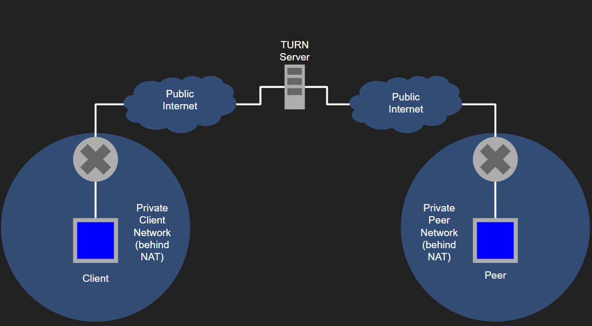
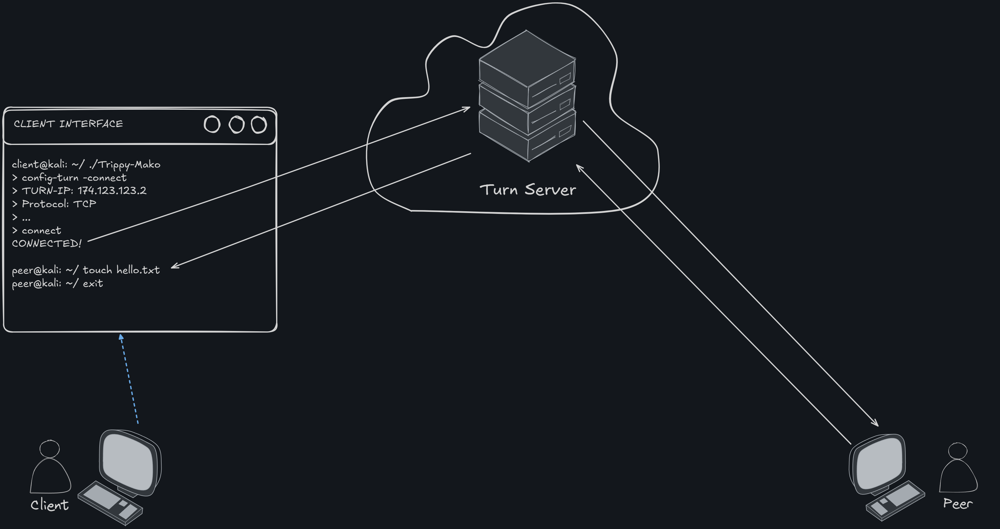

# Proposal: MARFORCYBER TURN Protocol CLI Tool

## Overview ✅

**What are you planning to build?**

Our team will build a Command Line Interface Tool that implements the TURN protocol, using RFC 8656 as our main source of documentation. This project consists of several main parts:

1. Command Line Interface: This tool will allow a user to use several commands such as,

  **configure**: Allows the user to enter in the TURN Server's public facing IP address, associated port number, as well as the user's desired protocol to use, and authentication measures. Different settings could affect the speed and size of the packets being sent across the network, which may be important to the user.

  **connect**: Allows the user to initiate a TCP connection over through the TURN server to establish a more permanent connection a peer, like a secure shell.

  **send**: Allows the user to send a payload using the specified protocol specified in the configuration stage.

  The tool will check the specified configuration during an action and, if it is incorrect, will highlight to the user what is incorrect and will prompt the user to make the changes with suggestions.

  **proxy**: Using this command will allow the user to create what is essentially an open tunnel to the peer through the TURN server to send data through that the peer will then send to other devices in the network. The tool will listen on a port and provide an interface for the user to send the payload through the tunnel.

2. TURN Implementation:

  Our implementation of the TURN protocol will be derived directly from our research on RFC 8656 and the various RFCs that support TURN to include the STUN protocol. Our implementation will focus on security to ensure that all traffic from the client to the peer through the TURN server is encrypted. We will not be using a python library, such as aiortc, due to the requests of our customer and the fact that this is not intended to be a WebRTC application. We want the autonomy to implement our own features without being tied to a huge library and build up our **trusted** codebase as we see fit.

This tool will allow users to send and receive data to another computer behind a NAT with a TURN server acting as an intermediary. The actual implementation of the protocol will be provided to our customer, Capt Burn, USMC at MARFORCYBER. Our tool will assist MARFORCYBER in current research and development needs by providing them with a standalone binary that can accomplish this task rather than a library that they would have to implement themselves.

**What problem will it solve?**

Our product will support MARFORCYBER in meeting its Research and Development requirements. The customer requires a standalone binary, independent of major libraries, that enables users to leverage the TURN protocol through a command-line interface (CLI) to either send a payload or establish a TCP connection providing shell access—an innovative use of TURN. Specifically, the customer requested security features like payload encryption and password protection, making a dedicated codebase more practical than a WebRTC-based implementation. This CLI tool will simplify independent usage for the customer and accelerate ongoing research efforts at MARFORCYBER.

**Why is it important?**

Our product will integrate directly with the customer’s ongoing research and development efforts upon launch. The customer requires a flexible, lightweight solution—one that cannot be achieved through WebRTC or Wireguard implementations due to the need for specific, mission-critical features. They are looking for a trusted codebase that meets these requirements without unnecessary overhead.

Additionally, our capstone will have a classified portion to it that will include work in the SCIF with our customer to produce extra features relevant to the classified mission set of MARFORCYBER.

**High-Level Diagram (OV-1)**

This diagram depicts a high level overview of how of the TURN protocol works. At the production stage, the client would utilize our CLI tool to easily communicate with a peer through a TURN server on the Internet.

## Market Research/Lit Review [X] [X]

**Existing Processes**  
Currently, our customer does not have any research or development efforts focused on our topic. While TURN has been identified as a useful protocol, a tailored tool that implements it in an accessible way is needed. Although our primary deliverable will be a CLI tool, the TURN protocol implementation will be shared with the customer to integrate into existing research initiatives.

**Market Research**  

**TURN/STUN**  
In typical settings, TURN (Traversal Using Relays around NAT) servers are used when connections to STUN (Session Traversal Utilities for NAT) servers fail. TURN operates in WebRTC (Web Real-Time Communication) environments, acting as a relay when a direct peer-to-peer connection is not possible. The TURN server relays information between peers, bypassing direct host-to-host communication.

**Additional Knowledge of Protocols used in TURN**

|TURN client to TURN server	| TURN server to peer |
|--------|----------|
|UDP |	UDP |
| TCP |	UDP | 
|TLS-over-TCP |	UDP |
|DTLS-over-UDP |	UDP |

[100ms](https://www.100ms.live/blog/webrtc-turn-server#transport-protocols)

We will utilize standard Transport protocols to communicate with the peer through the TURN server. The challenge that will will face depending on the network of the peer and the feature that the user wants to use i.e. send, proxy, or connect, is that we will need to create a TCP tunnel from the TURN server to the peer rather than UDP, which is what TURN is typically used for. (Most WebRTC implementations, for example, are used for audio and video RTC)

**WebRTC**

WebRTC (Real-Time Communication) is an open source project that implements various protocols to include TURN in order to achieve real-time audio and/or video communication from one peer to another. Other uses of WebRTC include streaming video and audio as well as file sharing. WebRTC provides the tools for developers to establish the connection between peers. In other words, the developer still needs to figure out how to implement the library. After the implementation of WebRTC's suite of protocols and API (for javascript) is complete the Real-Time Transport Protocol is used to transmit audio and/or data. 

A WebRTC agent is comprised of many protocols to include ICE, STUN, and TURN. It is an all-encompassing product with the primary purposes of establishing audio and video streams. An implementation of WebRTC is beyond the scope of what our customer is asking for and would not solve the ask of a standalone binary with the flexibility to meet the very specific requirements of the project, which is secure file transfer and a secure TCP connection from client to peer through a TURN server. The difference between our product and WebRTC is that our customer will not need to do any implementation on launch and it is specifically tailored to the needs mentioned above.

- [WebRTC - 1](https://restream.io/learn/what-is/webrtc/)
- [WebRTC - 2](https://webrtcforthecurious.com/docs/01-what-why-and-how/)

**aioRTC**

The aioRTC library on github is a WebRTC implementation and Object RTC API, which is used with WebRTC to make RTC applications for the web. AioRTC essentially WebRTC for the beginner. It simplifies the process of achieving the exchange of audio, video, and data channels. Some features include DTLS key and certificate generation, SCTP implementation sending and receiving of audio and video, data channels, etc. AioRTC functions similarly to the WebRTC API and provides a developer with a suite of Python classes and functions that make it easier for a developer to achieve RTC. We will not use this library to complete our project because it is once again out of the scope of what the customer needs. The goal of this project is not to create a TURN protocol suite but rather tool that allows a user to achieve a secure connection to a peer through a TURN server with the simple configuration of several settings through our CLI.

- [aioRTC](https://github.com/aiortc/aiortc)
- [ORTC](https://ortc.org/)

**Wireguard**  

Tailscale utilizes the Wireguard protocol, known for being lightweight, secure, and cross-platform. Wireguard's concise implementation (under 4,000 lines of code) ensures efficiency and speed compared to alternatives like OpenVPN. It encapsulates IP packets over UDP and uses advanced cryptography like Curve25519 and ChaCha20, offering simplicity comparable to SSH.

**Tailscale**  

Tailscale, a VPN service, securely connects devices globally by acting as an intermediary. Similar to our project, Tailscale falls back on STUN and ICE protocols when establishing connections. Our goal is to develop a TURN-based solution instead, filling MARFORCYBER's current research needs.

**Wireguard and Tailscale**

The main difference between our product and the combination of Tailscale and Wireguard is that we are very explicitly not using VPNs. The need from our customer is to create the desired features of our tool using a TURN server as an intermediary between the client and peer. We did get some inspiration from Tailscale since it provides the user with an interactive shell to the various peers that are associated with the client. We plan on accomplishing this same task through a TURN server, which is not a conventional use of TURN but one that is possible. 

### Similar Libraries

[Coturn](https://github.com/coturn/coturn)

This is an implementation of a TURN server that uses STUN. It can be spun up and used as a server to communicate from clients to peers. One notable thing about this library is that it allows the server to use "client-to-TURN-server protocols" which is remencent of how we would like to create a TCP connection via the server in our CLI. One way it is different is it appears that this server is primarily implemented to be a part of an ICE solution rather than a TURN solution.

[RTCTunnel: Building a WebRTC Proxy with Go (explains link below)](https://www.doxsey.net/blog/rtctunnel--building-a-webrtc-proxy-with-go/)
[Network tunnels over WebRTC](https://github.com/rtctunnel/rtctunnel)

This application is an implmentation of WebRTC which take advantage of different NAT traversal solutions. The difference between this approach and what we are doing is that in this approach the author has taken advantage of a pre built library for their NAT traversal. We plan on making our own NAT traversal solution based entirely around TURN and no other traversal solutions. In this project the author then took that solution and built a TCP proxy over it. In our solution we will do a similar thing but we hope to do an ssh type proxy via a known TURN server at the application layer. One thing this project highlights that will be important to for us is the one-to-many relationship of TCP. This allows the TURN server to communicate from one client to a single peer or many at once. This project is also a great example of how an implemented NAT traversal solution would function for an application like ours. Overall this library is great for getting a real example of how NAT solutions can be practically used.

[Archived Project for TURN SSH (Directs users to link above)](https://github.com/nobonobo/ssh-p2p)

[Pure Go implementation of the WebRTC API](https://github.com/pion/webrtc)
[gortc (STUN Library)](https://github.com/gortc/stun)

gortc is an implementation of the STUN protocol written in the go language. It supports TURN extensions for TCP allocations as well as the STUN protocol according to the STUN RFC (5389). There is a separate repository for a TURN implementation at gortc/turn that is based on TURN RFC 5766. These implementations essentially facilitate connections with their respective server types. Creating a connection with a TURN server in a similar fashion will be a part of the tool we are making.

[processone (STUN and TURN library for Erlang/Elixir)](https://github.com/processone/stun)

This library is a basic implementation of the STUN and TURN protocols as they work together in the WebRTC context. The STUN server obtains a desired IP of a peer, and the TURN server works on top of that to relay traffic if an IP is unavailable. The library is written in Erlang and requires no external dependencies from other languages to use. We will only be using a TURN server with our tool, so it differs from the classic peer-to-peer use cases that STUN and TURN are typically associated with.

### STUN Overview

[STUN Article on Medium](https://medium.com/@jamesbordane57/stun-server-what-is-session-traversal-utilities-for-nat-8a82d561533a)

This is an article that explains the STUN protocol in a more easily-digestible format. It enumerates a lot of the underlying networking concepts behind STUN, such as what a peer-to-peer connection is, how Network Address Translation works, and the limitation of the number of IPs in existence. It explains what the STUN server does on a step-by-step level to transmit data between peers in a number of different formats, such as UDP and TCP. It also mentions how the TURN and ICE protocols relate. This article is a helpful one-stop-shop other than the RFCs that we can reference as we need to review terms and concepts.

### TURN Overview

[CloudFlare TURN explanation](https://developers.cloudflare.com/calls/turn/what-is-turn/#:~:text=TURN%20works%20similar%20to%20a,and%20operate%20in%20distinct%20ways.)

This article goes over key concepts for to know for TURN, how TURN works, TURN vs VPNs, and why TURN is useful. TURN is an extension of the STUN protocol. Some of the key concepts of using TURN are TURN Server, TURN Client, Allocation, and Relayed transport address. The TURN server is the server that relays packets between client and peer. The TURN client is an application or device that uses TURN to communcate with another device or application. Allocation is when the TURN server reserves an IP and port unique to a clint. Relayed transport address is the IP address and port reserved on the TURN server that others can use to send to the TURN client. The basic steps of TURN are client requests allocation, TURN server creates allocation, client gives relayed address to peers. When peers send data to the address the server can forward it to the client and vice versa. The article specifically points out that **even though they operate similarily, TURN is not a VPN.** VPNs operate at the network layr and route all traffic from all applications through a server between devices but it is not a NAT traversal solution like TURN. TURN is specifically for real-time communication and operates at the application layer, only affecting traffic for the applciations that use it. This is crirical to our project because TURN is a NAT traversal solution and our customer is most interested in it because of its benefits of firewall bypassing and consistent ponnectivity. Many libraries that people would assume are for TURN are acutally for other protocols like ICE and use a TURN as a backup. In our project the customer knows they will have a TURN server so using these libraries is idiotic and doesn't make any sense in any from at all because TURN is the last option they use.

[Microsoft Learn on TURN](https://learn.microsoft.com/en-us/openspecs/office_protocols/ms-turn/bf1e2a02-4f6e-4975-b83c-74018546b387)

This is an article on extensions created by Microsoft for the TURN protocol. Along with the technical details on the extension like change tracking and product behavior, it includes a nice explanation of how TURN works, specifically the flow of TURN messages. It also includes an informative section on authentication, which may provide us one option we could use for authenticating payloads. We do not plan to use this extension, but it gives a good framework to go off of when building payloads.

### TURN Implementations/ Real Life Usages

[WebRTC](https://webrtc.org/)

This is the official WebRTC website that goes over what their code does, including how it interfaces with a TURN server. We are not interested in using WebRTC for our project and will be using a TURN server in a different way from WebRTC. As explained further above, WebRTC's main purpose is to provide high-quality streaming and video/audio communication. Our tool will be used for the transmission of data from files; therefore, we have no need for WebRTC's capability. To ensure the modularity of our tool, we will be creating our own interface that communicates with the TURN server. The only purpose of this link is to identify the existence of WebRTC.

[AnyConnect](https://anyconnect.com/stun-turn-ice/)

AnyConnect is an application similar to WebRTC that also handles video and audio transmission. This link goes to their official site. This site goes more into what STUN, TURN, ICE, and NAT are than the WebRTC site, which can be useful for our purposes. However, as with WebRTC, we have no use for the interface that AnyConnect provides. This link is simply to show that AnyConnect is on the market.

[TURN server implemented in Rust](https://crates.io/crates/turn-server)

This is a link to a download of a TURN server written in Rust. The software is described as being most compatible with WebRTC, so this would likely not be the best reference for us to test our tool on. This link serves as an example of something that is related to the tool we are building in concept but is not a tool that interfaces with a known TURN server through configuration like Trippy-Mako.

[eturnal TURN Server](https://eturnal.net/)

eturnal is a configurable TURN server that works with Unix or Windows and, much like the other examples above, is made for applications like WebRTC. It has a nice authentication mechanism with passwords that we could potentially reference for our tool, and many of the configuration options may be beneficial to look at as well. We will, of course, not use this tool ourselves for the same reasons given in the descriptions of the other applications and servers: we want to implement this ourselves to ensure modularity and trust from our customer.

### STUN Implementations

[STUNTMAN Tool](https://www.stunprotocol.org/)
[JSTUN Tool](https://jstun.javawi.de/)
[STUN Client](https://www.codeproject.com/Articles/18492/STUN-Client)

The above tools are for simple STUN server communication. Referencing them will not be exceedingly useful in our case given that we are not dealing solely with STUN and focusing on both STUN and TURN (with an emphasis on TURN, of course). These references are here to show more of a difference between what we are building and what exists. We are making a tool that technically communicates with a STUN server, but it does so with TURN overlayed throughout the whole process. These tools focus on sending packets through an established connection to a peer while we are connecting two peers to a server and transfering files.

## Discovery Insights ✅

1. CLI Tool

The design of the user interface is a deceivingly simple part of the project. The goal of the tool is to make it as simple as possible for the user to establish a connection to the TURN server and communicate with the peer. As highlighted in our market research, Metasploit is a good example of a tool that is easy to use and configure. A user guide and explanation of TURN and the various actions a user can choose from is crucial to this part of the project.

2. TURN

This project is not intended to function as a WebRTC application and, therefore, will avoid using any Python libraries that provide a WebRTC API. Instead, we will use the `struct` module to build packets and the `socket` module for low-level network communication. These modules allow us to implement TURN effectively while providing the flexibility needed to meet the customer’s requirements.

3. Authentication

A key requirement of this project is to encrypt traffic between the client and peer through the TURN server. A discussion with Professor Brown provided valuable insights on how to achieve this by creating a client-side certificate that the server can accept over a TLS connection, facilitated by OpenSSH.

## Proposed Design and Architecture ✅

**User Types/Personas**

Capt Burn, our customer, will use the tool to support MARFORCYBER's operations. Through interviews, we defined user stories and determined that the tool should be developed in Python, targeting Linux systems for peer-to-peer networking.

**System Design**

The CLI tool will support multiple features for the user to connect to present a simple configuration interface, drawing on usability parallels with Metasploit. Our TURN protocol implementation will be tightly integrated with authentication to ensure cohesive functionality.

    Metasploit: A tool used by cybercriminals as well as ethical hackers/pentesters to discover vulnerabilities on networks. Metasploit has a robust CLI with many features to aid the pentester. One such feature that is relevant to our project is the ability for a user to choose a specific payload and then configure the settings of the operation within seconds.

[Metasploit](https://www.varonis.com/blog/what-is-metasploit#:~:text=The%20Metasploit%20framework%20is%20a,used%20with%20most%20operating%20systems.)

**System Architecture**

The test architecture is visualized in the detailed diagram below:  

Testing will be a crucial part of our work. The diagram shows how we will create two networks behind symmetric NATs. The idea is to create a contained testing environment at first before we move onto spinning up a TURN server on the Internet.

## Project Management ✅

### Preliminary Release Plan

| Sprint | Duration | Start Date  | End Date    | Goals                                    | Deliverables                                     | Status     |
|--------|----------|-------------|-------------|------------------------------------------|--------------------------------------------------|------------|
| 1      | 2 weeks  | 2024-10-21  | 2024-11-03  | Set Up Python Environment                | Environment Setup for Testing and Development    | Finished   |
| 2      | 2 weeks  | 2024-11-17  | 2024-11-30  | CLI Tool Skeleton                        | Core CLI structure, basic configuration system   | Not Started |
|        |          |             |             |                                          | Commands for triggering main features (TURN, Auth)|            |
|        |          |             |             |                                          | Error handling, user feedback, help command      |            |
|        |          |             |             | Subitems: Testing and Feedback of Design       |                                                  |            |
| 3      | 3 weeks  | 2024-12-01  | 2024-12-21  | Virtual Box Testing Environment Setup    | VyOS Configuration, 5 VMs and 3 Vnets Setup, Terraform | Not Started |
|        |          |             |             | Subitems: 5 VMs, 3 Vnets Manual, Terraform, VyOS |                     |            |
| 4      | 4 weeks  | 2024-12-22  | 2025-01-18  | Authentication                           | TLS and Certificates                            | Not Started |
|        |          |             |             | Subitems: TLS and Tunneling, Forge Certificates, Server and Client Certificates, Trust Anchor: OpenSSH (Python library) | | |
| 5      | 2 weeks  | 2025-01-19  | 2025-02-01  | Implement TURN Protocol (Part 1)         | Allocate Request/Response Handling, Refresh Request Handling | Not Started |
|        |          |             |             | Subitems: Sending/Receiving Allocate Requests and Responses | | |
| 6      | 2 weeks  | 2025-02-02  | 2025-02-15  | Implement TURN Protocol (Part 2)         | CreatePermission Request/Response Handling, Send Indication | Not Started |
|        |          |             |             | Subitems: Refresh Request Handling, CreatePermission Handling | | |
| 7      | 2 weeks  | 2025-02-16  | 2025-03-01  | Implement TURN Protocol (Part 3)         | ChannelBind Request/Response, Data Relaying | Not Started |
|        |          |             |             | Subitems: Send/Receive Indications, UDP Datagram Handling | | |
| 8      | 2 weeks  | 2025-03-02  | 2025-03-15  | Implement TURN Protocol (Part 4)         | ChannelData Message Handling | Not Started |
|        |          |             |             | Subitems: Formatting and Relaying ChannelData Messages | | |
| 9      | 2 weeks  | 2025-03-16  | 2025-03-29  | Merge Authentication and TURN Protocol   | Integration of Authentication and TURN Features | Not Started |
| 10     | 2 weeks  | 2025-03-30  | 2025-04-12  | CLI Tool Development                     | Basic CLI Functionality | Not Started |
| 11     | 1 week   | 2025-04-13  | 2025-04-19  | Documentation                            | Finalize Documentation from Capstone Work | Not Started |

### Product Backlog

### Priority 1: CLI Tool Development (Skeleton)

- Bringing the skeleton of our tool to life will help to integrate our functionality into the user interface.
- Design structure of core CLI commands to interact with the system.
- Ensure commands can trigger the main features like TURN and Authentication when they are completed.
- Add a proper configuration menu system for each command to make the process as seamless and easy to use as Metasploit, for example.
- Add error handling and user feedback.
- Add a help command that explains what each command does and the necessary elements that the user will have to (or have the option of configuring)

### Priority 2: TURN Protocol Implementation

**Implement TURN Protocol (Part 1)**  

- Sending an Allocate Request
- Receiving an Allocate Request
- Receiving an Allocate Success/Failure Response
- Sending/Receiving a Refresh Request

**Implement TURN Protocol (Part 2)**

- Receiving a Refresh Response
- Creating/Receiving CreatePermission Requests and Responses
- Sending/Receiving Indications

**Implement TURN Protocol (Part 3)**  

- Handling UDP Datagrams and Data Indications
- Sending/Receiving ChannelBind Requests and Responses

**Implement TURN Protocol (Part 4)**

- Formatting ChannelData Messages
- Sending/Receiving ChannelData Messages
- Relaying Peer Data

## Priority 3: Tool Commands

- Use our implementation of TURN to allow the user to:
  - Send data to the peer
  - Establish a TCP connection to the peer to get a shell
  - Have the tool listen on a port to act as a proxy between it, the TURN server, and the client.
  - Ensure that the configuration for each command is seamless and easy to use for the user.

## Priority 4: Authentication

**TLS and Tunneling**  

- Implement TLS for secure data transmission
- Configure tunneling for communication security

**Forge Certificates**  

- Create/validate server and client certificates

**Server and Client Certificates**  

- Configure and test certificate functionality

**Trust Anchor: OpenSSH (Python Library)**  

- Integrate OpenSSH in the authentication flow

## Priority 5: Merge Authentication and TURN Protocol**

**Merge Authentication and TURN Protocol**  

- Integrate authentication with TURN protocol
- Ensure cohesive operation between components

### Lower Priority Tasks: Infrastructure Setup & Documentation

1. **Set Up Python Environment**
    - Install and configure necessary libraries for development.
    - Set up environment for testing and main codebase.

2. **Virtual Box Testing Environment Setup**
    - Set up 5 VMs and 3 Vnets.
    - Configure VyOS.
    - Implement infrastructure using Terraform.

3. **Documentation**
    - Consolidate and finalize documentation.
    - Ensure documentation reflects the work done throughout the project.
    - Create guides for installation, setup, and usage.

## **Risk Mitigation** ✅

**Complexity of TURN**

- Our research into the protocol must be in depth so we are not surprised by friction in our TURN scrums.

- Merging of Authentication and TURN.
  - Our implementation of TURN and authentication feature must be able to work together to securely communicate between the client, server, and peer(s).
  
**Documentation**

- Each feature must be properly documented for us and our customer.

- Each part of the TURN protocol builds upon each other so understanding the code that someone else potentially wrote for the previous part is vital to this capstone's success.

**Virtual Network**

- Proper set up of our virtual network, as shown in the System Architecture Diagram, will be crucial to the testing of our product.

**Testing**

- Every function of every feature must be thoroughly tested.

- Making use of pytest and other automatic testing suites will ensure that each piece is properly working down the line and that there are no surprises towards the end of the release plan.

## **Key Faculty Involvement** ✅

**Networking:** LCDR Downs

**Authentication:** Professor Brown

**General Development:** Capt Burn (MARFORCYBER)

## Admin/Fine Print ✅

**GFI/GFE (Government-Furnished Information/Equipment)**
  
None

**Customer Meeting Requirements/Plan**
  
We will meet with our customer every two weeks, ideally at the end of every sprint. 1/C Kreidler will be the primary POC between the group and Capt Burn to facilitate continuous communication.

**Acceptance Window**
  
The final version of our Capstone project will be complete by April.

**Code Delivery**
  
Every version of our Capstone project will be delivered to our customer through our repository every two weeks. Capt Burn is a member of our GitHub repository so he is constantly able to track our progress.

**Usage License**
  
The software developed as part of the capstone course becomes
property of the DoD. The Computer Science Department does not assume any
responsibility for maintaining the software produced for any customer of the capstone
project. The customer may use the software within the context of their USNA affiliation,
and may not distribute it without approval from the USNA legal office.
